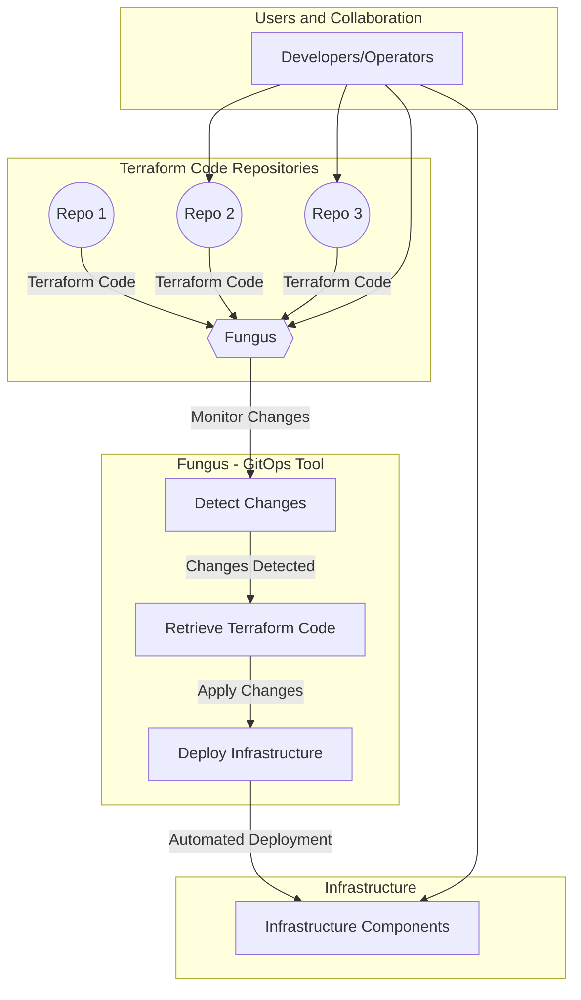

# Project Fungus: GitOps for Terraform Infrastructure Deployment

## Project Summary:
Project Fungus aims to create a GitOps tool similar to ArgoCD but specifically designed for Terraform infrastructure deployments. The tool will continuously monitor designated repositories for changes in the Terraform code, and upon detecting changes, it will automatically apply those changes to deploy and manage the corresponding infrastructure. This streamlined approach will enhance collaboration, version control, and automated deployment within infrastructure management using GitOps principles.

